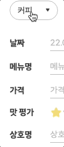
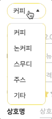

### 💎 문제원인

사용자가 게시글을 등록하는 폼에서 사용되는 셀렉트 박스를 구현하는 중이었다.
(styled-components로 작성해둔 코드를 HTML로 풀어본다.)

```html
<form>
  <div>
    <button></button>
    <ul>
      <li></li>
    </ul>
  </div>
</form>
```

<br />

**출력결과**

<figure style="width: 150px" class="align-left">
  
</figure>
 
셀렉트 박스를 클릭하면 옵션 목록이 그대로 떠있어야하는데, 나타났다 사라지는 것이 아닌가..?   
개발자 도구에서 확인해보니 브라우저가 계속 새로고침되고 있었다.

<br />

### 💎 원인파악

내가 잠깐 간과했던 한가지 `button`의 default type은 `submit`이다.  
이 기본 특성대로라면 당연하게도 `form` 태그 안에서 `button`의 역할은 양식 제출이기 때문에 데이터를 넘겨주면서 브라우저가 새로고침 되는 것!

<br />

### 💎 문제해결

`button` type에 button을 명시해준다.

```html
<button type='button></button>
```

<br />

**출력결과**

<figure style="width: 150px" class="align-left">
  
</figure>

button으로 type을 명시하게되면, 아무런 이벤트가 없는 정말 **버튼**의 기능을 하게된다.  
form 내에서 사용할 경우 반드시 type을 명시해주는 것이 좋으며,  
type이 button이어야 JS로 click 이벤트를 걸 수 있다.

```toc

```
